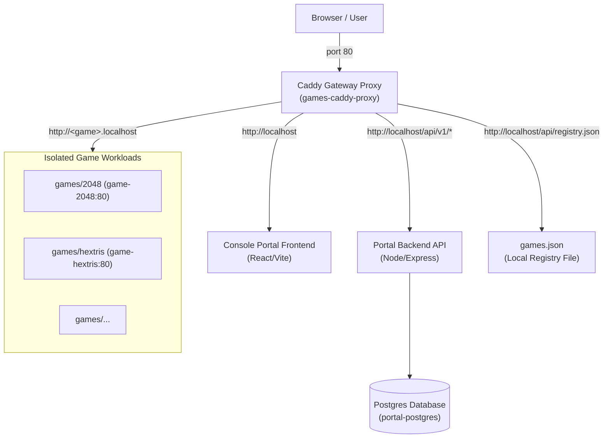

# System Architecture Memory

This document details the system design, network routing topology, and data flow of the Web Game Console Platform (WGCP) based on the project README[^base-readme] and base architecture[^base-architecture] documents.

---

## 🏗️ System Components

The WGCP platform consists of four main architectural blocks:

### 1. Ingress & Gateway (`caddy`)
* **Service**: `games-caddy-proxy` (Caddy v2 Alpine container).
* **Role**: Single entry point exposing port `80` to the host. Routes requests to the portal or specific games based on the request host name.
* **Config Files**:
  * `platform/Caddyfile.base`: Contains static routes for `localhost` (API endpoints, portal frontend, registry files).
  * `platform/Caddyfile`: The active, generated configuration file which appends game reverse-proxy directives.
* **API endpoints routed by Caddy**:
  * `/api/manifests/*` -> points to `/srv/registry/games.json`.
  * `/api/registry.json` -> points to `/srv/registry/games.json`.
  * `/api/v1/*` -> proxy to backend API container.

### 2. Unified Console Portal
* **Frontend**: React 18 / Vite 5 single-page application. Serves as the UI console. Uses a spatial navigation engine to handle gamepad/keyboard navigation.
* **Backend**: Node/Express REST API communicating with PostgreSQL.
* **Database**: PostgreSQL 15 container storing portal state and metadata.

### 3. State & Registry (`games.json`)
* **Location**: `platform/registry/games.json`
* **Role**: Generated list representing all registered/active games.
* **Consumption**: 
  * The frontend portal fetches it at `/api/registry.json` to render the game library.
  * Caddy config updates read it to build virtual-host routing tables.

### 4. Game Workloads
* Each game runs in its own Docker Compose stack.
* Games communicate with the gateway via dynamic, isolated Docker networks.

---

## 🔒 Security & Network Isolation

The platform enforces strict isolation rules to prevent cross-container chatter and unauthorized access:

1. **Isolated Networks**: Each game runs in its own network (e.g., `hextris_default`, `2048_default`). Game containers do not share networks with each other, meaning they cannot communicate.
2. **No Direct Host Ports**: Game containers do not publish ports directly to the host machine. Instead, they expose ports internally to their default compose networks.
3. **Gateway Bridging**: The `games-caddy-proxy` container is dynamically attached/detached to/from game networks (e.g. `docker network connect hextris_default games-caddy-proxy`) when games are added/removed. This allows Caddy to route traffic to `http://<service-name>:<port>` while acting as the sole ingress point.

[^base-readme]: Project README
[^base-architecture]: Base ARCHITECTURE document
