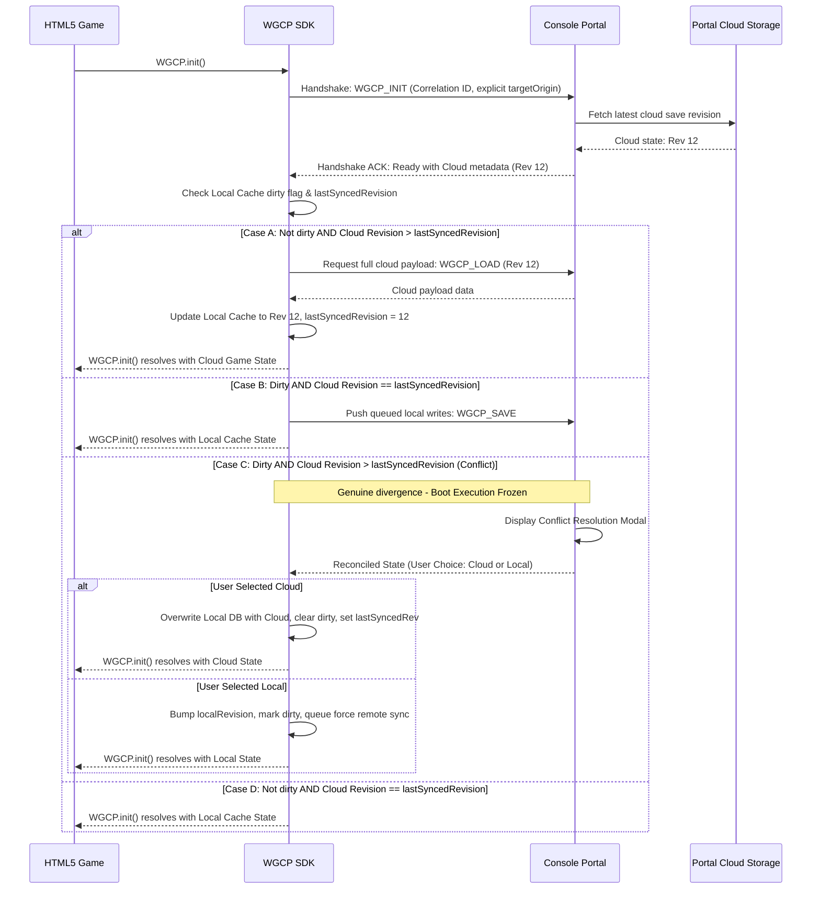
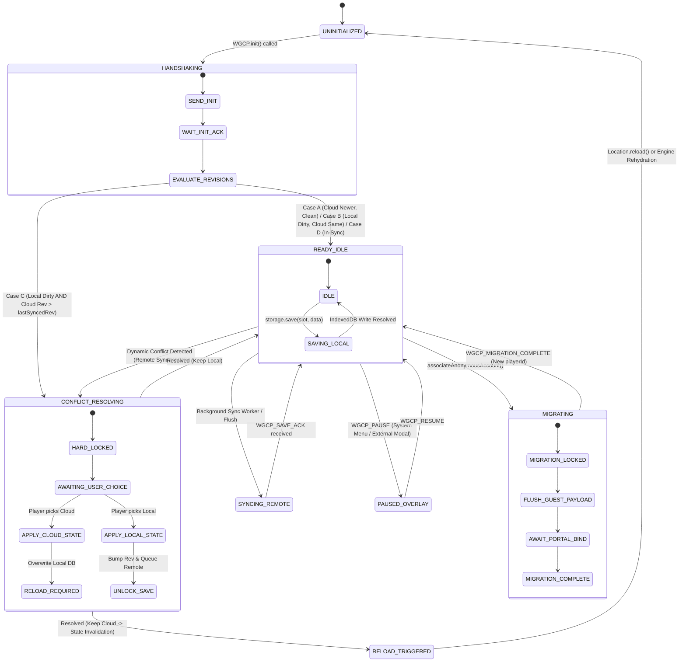

# Game SDK & Portal Synchronization Specification (P-002)

This document specifies the architecture, security controls, data schemas, protocol flows, and concurrency locking mechanisms for the **Web Game Console Platform (WGCP) Game SDK**. It governs the integration of hosted games with the central Console Portal wrapper.

---

## 1. Security & Trust Boundaries

The console portal maintains strict isolation boundaries. The hosted game iframe must be treated as an untrusted client environment.

### 1.1. Credential Sandboxing
* **Zero Credentials inside the Iframe**: Authentication tokens (e.g., `sessionToken`, OAuth tokens) **must never** be passed into the game iframe. 
* **Player Identifier**: The game is only provided with a contextual player ID (`playerId`) during initialization. All API requests that execute authentication or interact with external resources are brokered by the parent portal.

### 1.2. Hardened `postMessage` Protocol
All communication between the SDK inside the iframe and the Console Portal uses `window.postMessage`. Both ends must validate inputs strictly:
1. **Origin Verification**:
   * **Mandatory Explicit `targetOrigin`**: Every `postMessage` transmission dispatched by the SDK (`window.parent.postMessage(msg, portalOrigin)`) and by the Portal (`iframe.contentWindow.postMessage(msg, gameOrigin)`) **must specify the exact canonical origin of the recipient**. Broadcast wildcard `targetOrigin: '*'` is **strictly banned** across all SDK and Portal modules to prevent message interception by malicious framing windows or redirect destinations.[^i007-proposal-security-audit]
   * **SDK Parent Verification**: The SDK must listen only to messages originating from a verified portal host. **Dynamic origin inference** (e.g., parsing `document.referrer` or reading `window.parent.location.href`) **is banned** due to referrer-spoofing risks from framed environments. Allowed portal origins must be explicitly passed via initialization configuration (`init({ allowedOrigins: [...] })`) or built directly into the SDK environment parameters.[^i007-proposal-security-audit]
   * **Portal Game Verification (RFC 6454 Canonical Comparison)**: The Portal wrapper must verify that incoming messages satisfy conjunctive origin and window validation. Origins must be parsed using RFC 6454 canonical serialization:
     - The parser must guard against opaque origins by checking `typeof event.origin === 'string'` and `event.origin !== 'null'`. Incoming `"null"` origins or unparseable URIs must be safely dropped in a `try/catch` block without throwing unhandled exceptions that terminate global listeners.
     - Port matching must account for standard protocol port normalization: WHATWG URL parsing sets `url.port` to `""` for default protocol ports (`http:80`, `https:443`). Comparisons must compare canonical origin strings (`new URL(event.origin).origin === new URL(expectedOrigin).origin`) rather than raw port integer fields from `games.json`.[^i007-proposal-security-audit]
2. **Schema & Envelope Validation**:
   - Incoming payloads must be validated non-null objects: `typeof event.data === 'object' && event.data !== null && !Array.isArray(event.data)`.
   - The message correlation `id` must be validated against the standard UUIDv4 regular expression (`/^[0-9a-f]{8}-[0-9a-f]{4}-4[0-9a-f]{3}-[89ab][0-9a-f]{3}-[0-9a-f]{12}$/i`).
   - The `source` discriminator field must match the expected peer role (`'WGCP_SDK'` when received by Portal, `'WGCP_PORTAL'` when received by SDK) to prevent reflection and echo loops.
   - The `type` field must match a whitelist of known RPC string constants. Malformed structures or unknown types must be discarded immediately.
3. **Iframe Sandboxing**: All hosted game iframes in the portal launcher (`LauncherView.tsx`) must be rendered with strict HTML5 sandboxing:
   ```html
   <iframe
     src="http://<gameId>.localhost"
     sandbox="allow-scripts allow-same-origin allow-forms allow-downloads"
     allow="autoplay; fullscreen; gamepad"
   />
   ```
   Top-level navigation (`allow-top-navigation`, `allow-top-navigation-by-user-activation`), modal dialog privileges (`allow-modals`), and unconstrained popups (`allow-popups`) **must be omitted** to prevent game scripts from breaking out of the console frame, hijacking top-level navigation, or freezing portal UI threads.[^i007-proposal-security-audit]

### 1.3. Game Identity Verification (`gameId` Derivation)
* **No Spoofing**: The portal **does not trust** the `gameId` field declared inside payload messages. A malicious or compromised game iframe could attempt to supply another game's ID to overwrite its data.
* **Conjunctive Sender Verification**: The portal backend/wrapper identifies the game **exclusively** by conjunctively verifying:
  1. `event.origin` matches the registered game origin (`new URL(expectedGameUrl).origin`).
  2. `event.source` matches the active iframe's content window reference (`event.source === activeIframe.contentWindow`).
  `event.source` is set by the browser to the true sending window and cannot be forged by the sending page. The portal validates that the derived game ID matches the expected context before writing state. `document.activeElement` (a DOM-focus concept unrelated to message provenance) **must not** be used for this derivation: a backgrounded iframe can dispatch `postMessage` while a different iframe holds focus, and deriving identity from focus rather than the message's actual sender would misattribute writes between games.[^i006-leaderboard-identity-audit]

### 1.4. Checksum Validation
* **Verification Boundary**: Checksums (SHA-256) are calculated over the **raw, serialized data** before any compression (e.g., gzip/deflate) or encoding (e.g., Base64).
* **Portal Validation**: The portal validates the client-provided checksum by recalculating it over the received payload to ensure transport integrity before persisting it.

---

## 2. Synchronization & Conflict Resolution

The SDK implements an **Offline-First Asynchronous Synchronization** model. It handles latency, disconnection, and multi-session conflicts cleanly.

### 2.1. RPC Message Envelope Schema
All RPC calls are wrapped in a standard message envelope matching the recommended protocol structure:

```typescript
interface RPCMessage<T = unknown> {
  id: string;          // Cryptographic correlation ID (UUIDv4) for Promise matching
  type: string;        // Message identifier (e.g., 'WGCP_SAVE', 'WGCP_SAVE_ACK')
  source: 'WGCP_SDK' | 'WGCP_PORTAL';
  version: string;     // Protocol version (e.g., '2.0.0')
  payload: T;
  error?: {
    code: string;
    message: string;
    details?: Record<string, any>;
  };
}
```

### 2.2. Startup Sync Ordering & Boot Freeze
Upon game boot, synchronization must proceed in a strict order to prevent stale local cache files from overwriting newer cloud-saved state. Comparing revision numbers alone is **not sufficient**: a higher cloud revision only proves the cloud was written more recently, not that the local cache holds no unsynced work. A local cache that was written to while offline (and never confirmed by the portal) must be treated as `dirty` and reconciled explicitly rather than silently discarded.[^i005-boundary-audit]

**Gating `WGCP.init()` during Conflict (Case C)**: In Case C (`dirty == true AND Cloud Revision > lastSyncedRevision`), `WGCP.init()` **must not** resolve into the game's running state with un-reconciled local data. Resolving early allows un-gated game auto-save loops to execute and overwrite local storage during user review. The Portal wrapper immediately freezes boot execution and renders the Conflict Resolution Modal. `WGCP.init()` resolves **only after** the user selects their active track, returning the definitive reconciled payload.



### 2.3. Monotonic Revision Sequencing, Conflict Intervention & State Invalidation
* **Client Timestamp Deprecation**: Client-side clocks are unreliable, subject to drift, and easily manipulated. Timestamps **must not** be used for primary conflict resolution.
* **Monotonic Revisions**: Every state write is incremented with a server-assigned monotonic revision number (e.g. `revision: 12`). If the client attempts to write a state without knowing the current server revision, or uses an outdated sequence number, the portal returns a revision conflict error.
* **Dirty-State Tracking**: The local cache record stores a `dirty` flag and a `lastSyncedRevision` distinct from its working `localRevision`. `dirty` is set on any `saveState` write that has not yet received a server ACK, and cleared only on confirmed sync. This distinguishes "cloud is simply newer" (safe to pull) from "local has unsynced writes AND cloud has moved independently" (a genuine conflict).[^i005-boundary-audit]
* **Conflict Intervention**: A write conflict — defined as `dirty == true` while `Cloud Revision > lastSyncedRevision` — **must never** be resolved by silently overwriting the local cache with the cloud payload. The portal triggers a user interface dialog allowing the player to select the active save track (discarding local changes or overriding cloud).
* **Dual-Tier Storage-Locking Architecture**:
  1. **Hard Storage Lock (Local & Remote Blocked)**: While the conflict resolution UI overlay is active (`CONFLICT_RESOLVING`) or during account migration (`MIGRATING`), the SDK **hard-locks** all storage write operations. Any call to `WGCP.storage.save`, `load`, or `delete` is rejected immediately at the SDK API boundary with code `ERROR_SYNC_PENDING_RESOLUTION` or `ERROR_MIGRATION_IN_PROGRESS`. This prevents stacked pending promises and memory leaks.[^i007-proposal-security-audit]
  2. **Soft Sync Lock (Local Allowed, Remote Capped)**: When the offline cloud sync queue is full (10 items), `WGCP.storage.save()` **must continue to write successfully to local IndexedDB**. The pending background cloud upload is rejected/deferred, and the optional `onSync` callback receives `ERROR_QUEUE_FULL`. This guarantees offline progress is never lost.[^i008-proposals-iterative-scrutiny]
* **State Invalidation Protocol**: If the user selects the cloud save option in the conflict resolution dialog:
  1. The SDK overwrites local IndexedDB with the cloud state, resets `dirty = false`, and updates `lastSyncedRevision`.
  2. All pending in-flight local `onSync` promises are aborted with `ERROR_SYNC_ABORTED`.
  3. The SDK notifies the game via `WGCP.storage.onStateReloaded(cloudState)`. If the game has not registered an `onStateReloaded` handler, the Portal wrapper executes an automatic iframe reload (`window.location.reload()`) to prevent divergent in-memory JavaScript/WASM heap state from silently overwriting the chosen cloud track on the next auto-save.

### 2.4. Queue Management, Per-Slot Mutex & Storage Partitioning
1. **Per-Slot FIFO Write Mutex with Latest-Wins Coalescing**:
   - The SDK must serialize all `save()` operations targeting the same save slot via an internal FIFO mutex.
   - If multiple rapid calls to `save(slot, data)` occur before the preceding write finishes (e.g. 60 saves/sec), intermediate states are coalesced into a single trailing-edge write, preventing IndexedDB transaction race conditions and out-of-order cloud updates.
   - Monotonic client sequence numbers (`clientSeq`) are assigned to each save operation. The Portal backend rejects any payload where `clientSeq <= lastCommittedClientSeq`.
2. **Queue Bounds & Local Write Separation**: The remote cloud synchronization queue has a maximum capacity of 10 operations. Local writes to IndexedDB always resolve immediately. If the remote sync queue reaches 10 pending slot operations, further cloud sync queuing returns `ERROR_QUEUE_FULL` via `onSync` to alert the game client that remote syncing is suspended until reconnection, while local persistence remains intact.[^i008-proposals-iterative-scrutiny]
3. **Strict Queue Partitioning**: The persistence save queue (`WGCP.storage`) and the stats delta queue (`WGCP.stats`) operate in completely independent queue instances and storage partitions. Heavy save state writes and rapid stat updates never contend for queue slots or block each other.[^i007-proposal-security-audit]
4. **Untrusted-Claim Exclusion**: Self-trusted persistence writes (`saveState`) queue normally per the rules above. Untrusted-claim calls defined by services built on this transport (e.g. leaderboard score submissions, achievement unlocks) **must not** be queued for later offline delivery — any verification token or transaction context bound to those calls at issue time goes stale while queued, undermining the trust guarantees the calling service relies on. Services with untrusted-claim semantics must fail or retry those calls online-only, not via this queue.[^i006-leaderboard-identity-audit]

### 2.5. Formal Finite State Machine (FSM) & State Transitions

To guarantee deterministic execution, the Game SDK and Portal Bridge implement the following formal Finite State Machine:



#### State Transition Matrix & Operational Rules:

| Current State | Trigger Event | Guard / Condition | Action / Behavior | Next State | Storage Save Contract |
| :--- | :--- | :--- | :--- | :--- | :--- |
| **`UNINITIALIZED`** | `WGCP.init()` | None | Dispatches `WGCP_INIT` envelope with UUID correlation ID and explicit targetOrigin. | `HANDSHAKING` | **REJECT** (`ERROR_NOT_INITIALIZED`) |
| **`HANDSHAKING`** | `WGCP_INIT_ACK` | `dirty == false` && `CloudRev > lastSyncedRev` (Case A) | Requests `WGCP_LOAD`, writes cloud state to IndexedDB, sets `lastSyncedRev = CloudRev`. `init()` resolves with Cloud State. | `READY_IDLE` | **REJECT** (`ERROR_NOT_INITIALIZED`) |
| **`HANDSHAKING`** | `WGCP_INIT_ACK` | `dirty == true` && `CloudRev == lastSyncedRev` (Case B) | Pushes queued writes via `WGCP_SAVE`. `init()` resolves with Local State. | `READY_IDLE` | **REJECT** (`ERROR_NOT_INITIALIZED`) |
| **`HANDSHAKING`** | `WGCP_INIT_ACK` | `dirty == true` && `CloudRev > lastSyncedRev` (Case C) | **FREEZE BOOT**. Do NOT resolve `init()`. Portal opens Conflict Modal. | `CONFLICT_RESOLVING` | **REJECT** (`ERROR_SYNC_PENDING_RESOLUTION`) |
| **`HANDSHAKING`** | `WGCP_INIT_ACK` | `dirty == false` && `CloudRev == lastSyncedRev` (Case D) | `init()` resolves immediately with Local State. | `READY_IDLE` | **REJECT** (`ERROR_NOT_INITIALIZED`) |
| **`READY_IDLE`** | `storage.save(slot, data)` | Slot mutex is free | Writes to local IndexedDB `game_saves`. Updates `dirty = true`, `localRevision++`. Resolves local promise. Queues remote sync. | `READY_IDLE` | **ACCEPT** (Writes to local IndexedDB) |
| **`READY_IDLE`** | `WGCP_PAUSE` | Received from Portal | Emits `onPause()`, suspends `AudioContext`, gates gamepad input, releases Pointer Lock, emits synthetic `keyup`. | `PAUSED_OVERLAY` | **ACCEPT** (Local save queued or processed; engine loop should halt) |
| **`PAUSED_OVERLAY`**| `WGCP_RESUME` | Received from Portal | Emits `onResume()`, restores `AudioContext`, un-gates gamepad, recalibrates delta clock (`WGCP.time.getDelta()`). | `READY_IDLE` | **ACCEPT** |
| **`READY_IDLE`** | Dynamic Conflict NACK | Server reports revision conflict on background sync | Pauses game loop (`WGCP_PAUSE`), transitions SDK to hard lock, displays conflict dialog. | `CONFLICT_RESOLVING` | **HARD LOCK** (Reject with `ERROR_SYNC_PENDING_RESOLUTION`) |
| **`CONFLICT_RESOLVING`**| User selects Local | UI user input | Marks local state as winner, queues force-overwrite `WGCP_SAVE(force: true)`, unpauses game. | `READY_IDLE` | Re-enabled. |
| **`CONFLICT_RESOLVING`**| User selects Cloud | UI user input | Writes Cloud state to IndexedDB, clears `dirty`, resets `lastSyncedRev`. Aborts all pending local syncs with `ERROR_SYNC_ABORTED`. Triggers State Invalidation. | `RELOAD_TRIGGERED` | **HARD LOCK** until reloaded. |
| **`READY_IDLE`** | `associateAnonymousAccount()` | Portal auth login | Dispatches `WGCP_MIGRATION_START`. Flushes pending guest state to portal. | `MIGRATING` | **HARD LOCK** (`ERROR_MIGRATION_IN_PROGRESS`) |
| **`MIGRATING`** | `WGCP_MIGRATION_ACK` | Migration committed on server | Updates `playerId`, un-locks storage, emits `onPlayerChanged`. | `READY_IDLE` | Re-enabled under new `playerId`. |

---

## 3. Storage Constraints & Payloads

To ensure stability across resource-heavy games (such as WebAssembly compilations), storage tiering and object store partitioning are strictly enforced.

### 3.1. Enforced Storage Tiering & IndexedDB Store Partitioning
* **`localStorage` (Metadata Only)**: Reserved strictly for small configuration keys, protocol handshake states, and transaction queue headers. It must never store heavy game save files due to its synchronous nature and strict ~5MB limit.
* **`IndexedDB` (Partitioned Stores)**: Mandated for all heavy game state payloads and persistent offline queues. The SDK creates database `wgcp_storage_<gameId>` (Version 2) with three disjoint object stores:
  1. `game_saves`: Keyed by `slot: string`. Stores `{ slot: string, payload: ArrayBuffer | Blob | object, checksum: string, localRevision: number, lastSyncedRevision: number, dirty: boolean, updatedAt: number }`.
  2. `stats_cache`: Keyed by `statId: string`. Stores `{ statId: string, syncedValue: number, lastSyncedAt: number }`.
  3. `stats_queue`: Keyed by `statId: string`. Stores `{ statId: string, op: 'DELTA' | 'SET', delta?: number, val?: number, updatedAt: number }`.
* **Transaction Isolation Guarantee**: All operations on `game_saves` and `stats_*` utilize independent IndexedDB readwrite transactions on disjoint stores. Large binary serialization for game saves will never block or lock stat increments.[^i007-proposal-security-audit]
* **No Transparent `localStorage` Interceptor**: `WGCP.storage.*` is the sole, canonical asynchronous storage contract. A transparent `localStorage`-intercepting shim was evaluated and rejected: it forces a sync-to-async impedance mismatch (pre-fetching the entire storage dictionary at handshake) and risks cloud-syncing device-specific settings (window scale, local volume) across devices. Games integrate via a small async entry-point script that awaits `WGCP.storage.*` before instantiating the game engine.[^i005-boundary-audit]

### 3.2. Binary Data Support
* **ArrayBuffer & Blob Formats**: The message protocol natively supports `ArrayBuffer` and `Blob` structures for game states (e.g., compiled binary files generated by Emscripten). This avoids the 33% inflation overhead of Base64 strings. `postMessage` transferables are leveraged where supported to eliminate structured clone memory copies.

### 3.3. Emscripten Sync Bridge (`WGCP.syncFS`)
WASM games running under Emscripten require a call to `FS.syncfs` to synchronize the in-memory virtual directory (`MEMFS`) with browser `IndexedDB` (`IDBFS`). The SDK exposes a utility method `WGCP.syncFS()` which coordinates this automatically prior to serializing state back to the portal.

---

## 4. Identity Management & Anonymous Migration

A unified experience requires supporting transition flows for guests logging into permanent accounts.

### 4.1. Guest-to-User State Promotion (`associateAnonymousAccount`)
When a player starts a session anonymously (guest mode) and subsequently logs in to the console portal:
1. The portal prompts the user to link their guest progress.
2. The SDK transitions to the `MIGRATING` state and sends the local anonymous data package via the `associateAnonymousAccount()` flow.
3. **Sequential Phase-Locking**: To prevent race conditions where the game's `onPlayerChanged` callback fires and triggers a `loadState()` of old cloud data *before* the local guest save finishes uploading, the Portal wrapper must enforce a locked workflow: it must wait for the database migration transaction to complete successfully **before** updating the active `playerId` and notifying the SDK of the identity change.[^i007-proposal-security-audit]
4. During migration, any storage write operations are rejected with `ERROR_MIGRATION_IN_PROGRESS`.
5. The Portal validates this request, writes the data to the newly authenticated cloud profile, updates the active `playerId`, and dispatches `WGCP_MIGRATION_ACK` to transition the SDK back to `READY_IDLE`.

```mermaid
graph TD
    A[Guest Player achieves high score / progress]
    A --> B[Player logs in to Console Portal]
    B --> C[Portal triggers associateAnonymousAccount()]
    C --> D[SDK enters MIGRATING hard-lock state]
    D --> E[SDK packages local guest IndexedDB state]
    E --> F[SDK sends WGCP_MIGRATE postMessage]
    F --> G[Portal validates request and binds state to Cloud profile]
    G --> H[Portal emits WGCP_MIGRATION_ACK with new playerId]
    H --> I[SDK unlocks storage and fires onPlayerChanged]
```

---

## 5. API Design & Domain Logic

Data persistence operates on a separate trust and lifecycle model compared to achievements and scoreboard submissions.

### 5.1. Split Trust Models
1. **Game Persistence (Self-Trusted)**: Save states belong to the player. The portal validates schema structure, versions, and checksums, but does not interfere with the game state content.
2. **Untrusted Claims (Server-Validated)**: Telemetry data, achievements, and scoreboard scores are highly susceptible to client-side manipulation. The portal backend must parse these events, check timestamps, detect velocity anomalies, and run secondary server-side checks before updating leaderboards or unlocking rewards.

### 5.2. Idempotency Unlocks
All achievement unlocks must be strictly idempotent. The message envelope must accept a unique identifier (`txId`) for the unlock event. If the portal backend receives duplicate unlock signals for the same achievement ID, it registers the action once and returns a successful response without duplicating records.

### 5.3. SDK API Interface Refinement
The revised API provides separation between local caching (immediate return) and remote synchronization verification:

```javascript
window.WGCP = {
  // Initialization - resolves when handshake and revision evaluation complete.
  // In Case C conflict, resolution is gated until user selects track via portal modal.
  init: function(options) {
    return new Promise((resolve, reject) => { /* ... */ });
  },

  // Storage persistent module
  storage: {
    // Save progress - resolves immediately when written to local IndexedDB game_saves store.
    // An optional onSync callback notifies when the remote portal backend ACK is received (or returns ERROR_QUEUE_FULL).
    save: function(slot, data, onSync) {
      return new Promise((resolve, reject) => { /* ... */ });
    },

    // Load progress - retrieves state from local cache or fetches from cloud if newer
    load: function(slot) {
      return new Promise((resolve, reject) => { /* ... */ });
    },

    // Delete slot - deletes data from both local cache and parent portal storage
    delete: function(slot) {
      return new Promise((resolve, reject) => { /* ... */ });
    },

    // State Invalidation Hook - fired when player chooses cloud track during conflict resolution.
    // Games with live rehydration use this hook to update memory without a page reload.
    onStateReloaded: function(callback) {
      /* Registers callback: (reloadedState) => void */
    }
  },

  // WASM Utility - triggers Emscripten FS.syncfs
  syncFS: function() {
    return new Promise((resolve, reject) => { /* ... */ });
  }
};
```
*Note: Service claim APIs (Achievements, Leaderboards, Player Stats, Progression) are excluded from the core transport namespace `window.WGCP`, and reside inside their respective modular namespaces defined in P-003.*

---

## 6. References & Audit Notes

[^i005-boundary-audit]: WGCP SDK Completeness and Boundary Scrutiny (`/investigations/I-005-sdk-completeness-and-boundary-scrutiny.md`)
[^i006-leaderboard-identity-audit]: Leaderboard & Identity Boundary Audit (`/investigations/I-006-leaderboard-identity-boundary-audit.md`)
[^i007-proposal-security-audit]: Proposal Security, Race-Condition, and Queue Audit (`/investigations/I-007-proposal-security-race-queue-audit.md`)
[^i008-proposals-iterative-scrutiny]: Proposals Iterative Scrutiny and Hardening Report (`/investigations/I-008-proposals-iterative-scrutiny.md`)
