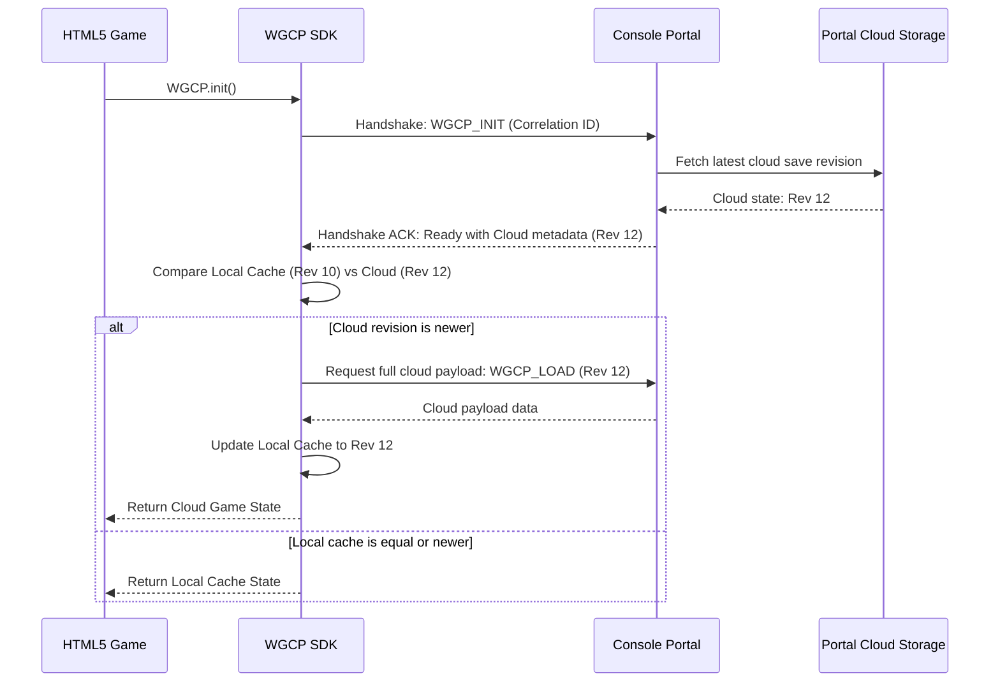

# Game SDK & Portal Synchronization Specification (P-002)

This document specifies the architecture, security controls, data schemas, and protocol flows for the **Web Game Console Platform (WGCP) Game SDK**. It addresses the integration of hosted games with the central Console Portal wrapper.

---

## 1. Security & Trust Boundaries

The console portal maintains strict isolation boundaries. The hosted game iframe must be treated as an untrusted client environment.

### 1.1. Credential Sandboxing
* **Zero Credentials inside the Iframe**: Authentication tokens (e.g., `sessionToken`, OAuth tokens) **must never** be passed into the game iframe. 
* **Player Identifier**: The game is only provided with a contextual player ID (`playerId`) during initialization. All API requests that execute authentication or interact with external resources are brokered by the parent portal.

### 1.2. Hardened `postMessage` Protocol
All communication between the SDK inside the iframe and the Console Portal uses `window.postMessage`. Both ends must validate inputs strictly:
1. **Origin Verification**:
   * The SDK must listen only to messages originating from the verified portal host (configured on SDK initialization or dynamically inferred from parent environment).
   * The Portal must verify that `event.origin` matches the host registered for the specific game in the registry (`games.json`).
2. **Schema Validation**: All incoming and outgoing payloads must conform to the standard message envelope. Unrecognized message structures, unknown types, or malformed correlation IDs must be discarded immediately.

### 1.3. Game Identity Verification (`gameId` Derivation)
* **No Spoofing**: The portal **does not trust** the `gameId` field declared inside payload messages. A malicious or compromised game iframe could attempt to supply another game's ID to overwrite its data.
* **Contextual Derivation**: The portal backend/wrapper identifies the game by mapping the active iframe element (`document.activeElement` or cross-referenced frame ID) to its registered registry entry. The portal validates that the derived game ID matches the expected context before writing state.

### 1.4. Checksum Validation
* **Verification Boundary**: Checksums (SHA-256) are calculated over the **raw, serialized data** before any compression (e.g., gzip/deflate) or encoding (e.g., Base64).
* **Portal Validation**: The portal validates the client-provided checksum by recalculating it over the received payload to ensure transport integrity before persisting it.

---

## 2. Synchronization & Conflict Resolution

The SDK implements an **Offline-First Asynchronous Synchronization** model. It handles latency, disconnection, and multi-session conflicts cleanly.

### 2.1. RPC Message Envelope Schema
All RPC calls are wrapped in a standard message envelope matching the recommended protocol structure:

```typescript
interface RPCMessage<T = unknown> {
  id: string;          // Cryptographic correlation ID (UUIDv4) for Promise matching
  type: string;        // Message identifier (e.g., 'WGCP_SAVE', 'WGCP_SAVE_ACK')
  source: 'WGCP_SDK' | 'WGCP_PORTAL';
  version: string;     // Protocol version (e.g., '2.0.0')
  payload: T;
  error?: {
    code: string;
    message: string;
  };
}
```

### 2.2. Startup Sync Ordering
Upon game boot, synchronization must proceed in a strict order to prevent stale local cache files from overwriting newer cloud-saved state:



### 2.3. Monotonic Revision Sequencing
* **Client Timestamp Deprecation**: Client-side clocks are unreliable, subject to drift, and easily manipulated. Timestamps **must not** be used for primary conflict resolution.
* **Monotonic Revisions**: Every state write is incremented with a server-assigned monotonic revision number (e.g. `revision: 12`). If the client attempts to write a state without knowing the current server revision, or uses an outdated sequence number, the portal returns a revision conflict error.
* **Conflict Intervention**: If a write conflict is encountered (e.g., concurrent playing sessions), the portal triggers a user interface dialog allowing the player to select the active save track (discarding local changes or overriding cloud).

### 2.4. Queue Management & Deduplication
1. **Deduplication**: If multiple `saveState` calls target the same slot during an offline session, only the latest state is stored in the sync queue; redundant intermediate saves are pruned.
2. **Queue Bounds**: The synchronization queue has a maximum payload limit (default: 10 operations). Once exceeded, older saves are dropped (excluding high-priority telemetry) to prevent infinite memory growth, and the user is warned of disconnected save states.

---

## 3. Storage Constraints & Payloads

To ensure stability across resource-heavy games (such as WebAssembly compilations), storage tiering is strictly enforced.

### 3.1. Enforced Storage Tiering
* **`localStorage` (Metadata Only)**: Reserved strictly for small configuration keys, protocol handshake states, and transaction queue headers. It must never store heavy game save files due to its synchronous nature and strict ~5MB limit.
* **`IndexedDB` (Game States)**: Mandated for all heavy game state payloads, level data, and save slots. This prevents blocking the browser main thread and provides asynchronous access to larger storage pools.

### 3.2. Binary Data Support
* **ArrayBuffer & Blob Formats**: The message protocol natively supports `ArrayBuffer` and `Blob` structures for game states (e.g., compiled binary files generated by Emscripten). This avoids the 33% inflation overhead of Base64 strings.

### 3.3. Emscripten Sync Bridge (`WGCP.syncFS`)
WASM games running under Emscripten require a call to `FS.syncfs` to synchronize the in-memory virtual directory (`MEMFS`) with browser `IndexedDB` (`IDBFS`). The SDK exposes a utility method `WGCP.syncFS()` which coordinates this automatically prior to serializing state back to the portal.

---

## 4. Identity Management & Anonymous Migration

A unified experience requires supporting transition flows for guests logging into permanent accounts.

### 4.1. Guest-to-User State Promotion (`associateAnonymousAccount`)
When a player starts a session anonymously (guest mode) and subsequently logs in to the console portal:
1. The portal prompts the user to link their guest progress.
2. The SDK sends the local anonymous data package via the `associateAnonymousAccount()` flow.
3. The Portal validates this request, writes the data to the newly authenticated cloud profile, and updates the active `playerId`.

```mermaid
graph TD
    A[Guest Player achieves high score / progress]
    A --> B[Player logs in to Console Portal]
    B --> C[Portal triggers associateAnonymousAccount()]
    C --> D[SDK package local guest IndexedDB state]
    D --> E[SDK sends WGCP_MIGRATE postMessage]
    E --> F[Portal validates request and binds state to Cloud profile]
```

---

## 5. API Design & Domain Logic

Data persistence operates on a separate trust and lifecycle model compared to achievements and scoreboard submissions.

### 5.1. Split Trust Models
1. **Game Persistence (Self-Trusted)**: Save states belong to the player. The portal validates schema structure, versions, and checksums, but does not interfere with the game state content.
2. **Untrusted Claims (Server-Validated)**: Telemetry data, achievements, and scoreboard scores are highly susceptible to client-side manipulation. The portal backend must parse these events, check timestamps, detect velocity anomalies, and run secondary server-side checks before updating leaderboards or unlocking rewards.

### 5.2. Idempotency Unlocks
All achievement unlocks must be strictly idempotent. The message envelope must accept a unique identifier for the unlock event. If the portal backend receives duplicate unlock signals for the same achievement ID, it registers the action once and returns a successful response without duplicating records.

### 5.3. SDK API Interface Refinement
The revised API provides separation between local caching (immediate return) and remote synchronization verification:

```javascript
window.WGCP = {
  // Initialization - resolves when handshake completes
  init: function(options) {
    return new Promise((resolve, reject) => { ... });
  },

  // Save progress - resolves when written to local IndexedDB. 
  // An optional onSync callback notifies when the remote portal backend ACK is received.
  saveState: function(slot, data, onSync) {
    return new Promise((resolve, reject) => { ... });
  },

  // Load progress - retrieves state from local cache or fetches from cloud if newer
  loadState: function(slot) {
    return new Promise((resolve, reject) => { ... });
  },

  // Delete slot - deletes data from both local cache and parent portal storage
  deleteState: function(slot) {
    return new Promise((resolve, reject) => { ... });
  },

  // WASM Utility - triggers Emscripten FS.syncfs
  syncFS: function() {
    return new Promise((resolve, reject) => { ... });
  },

  // Untrusted Claim - Submits score to Leaderboard
  submitScore: function(score, metadata) {
    return new Promise((resolve, reject) => { ... });
  },

  // Untrusted Claim - Unlocks achievement idempotently
  unlockAchievement: function(achievementId) {
    return new Promise((resolve, reject) => { ... });
  }
};
```
