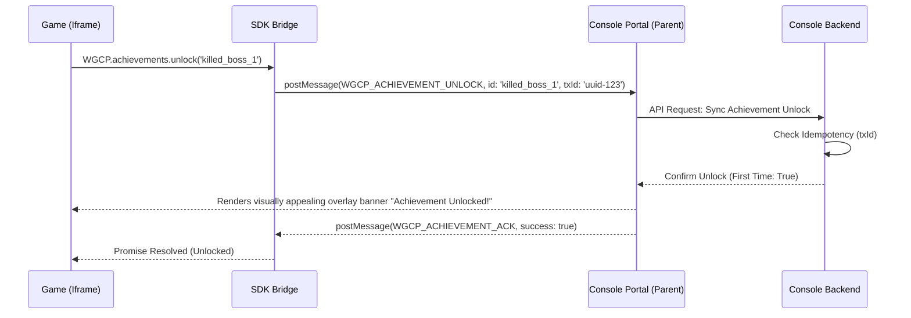
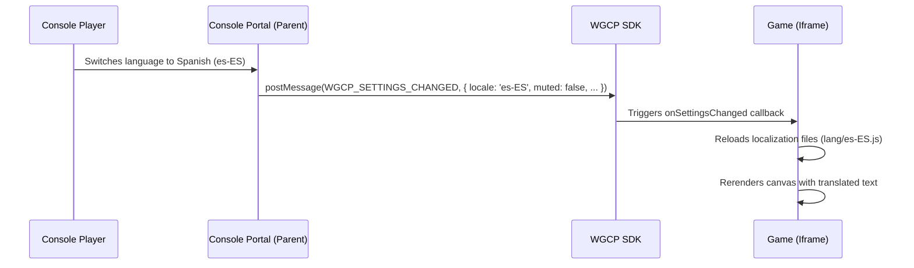

# Game Services API Specification (P-003)

This proposal defines the design, messaging contracts, and runtime interfaces for the **Web Game Console Platform (WGCP) Game Services API**. It extends the transport and security models introduced in [`P-002-game-sdk-storage-sync.md`](file:///home/vijaykoushik/Evee/My%20Documents/GitHub/Games/.agents/memory/proposals/P-002-game-sdk-storage-sync.md) to support platform features: Identity, Achievements, Leaderboards, Telemetry/Lifecycle tracking, System Settings, Player Stats, Personal Bests, and Progressions.

It incorporates architectural lessons from leading web console platforms analyzed in [`I-002-web-game-sdk-archeology.md`](file:///home/vijaykoushik/Evee/My%20Documents/GitHub/Games/.agents/memory/investigations/I-002-web-game-sdk-archeology.md) and native platform statistic architectures detailed in [`I-003-platform-stats-progression-model.md`](file:///home/vijaykoushik/Evee/My%20Documents/GitHub/Games/.agents/memory/investigations/I-003-platform-stats-progression-model.md).

---

## 1. Overview & Architectural Goals

The WGCP Game Services API provides a set of features that help games integrate with the console ecosystem. Rather than just acting as a save-game synchronizer, the SDK enables games to communicate their state changes to the portal and adjust their gameplay based on console-wide settings (such as muting audio or changing language locales).

### Core Goals:
1. **Decoupled Architecture**: Games remain self-contained. The SDK provides a unified frontend that falls back to in-memory mocks when the game is played standalone.
2. **Unified UX overlay**: Achievements and system settings are displayed to players through a consistent portal user interface, rather than each game styling these elements separately.
3. **Decoupled Analytics & Stats**: Separating player statistics and progression metrics from heavy game-save files allows the portal to aggregate player summaries across different titles without parsing game-specific binary saves.
4. **Optimized Latency**: Non-blocking asynchronous RPC calls ensure game loop rendering is never blocked by network requests to the console backend.

---

## 2. Division of Services & Trust Boundaries

To enforce security and reliability, services are divided into clear operational tiers based on trust and complexity.

### 2.1. Architectural Tiers

| Service Name | SDK (Client/Iframe) | Portal Wrapper (Parent) | Console Backend / Database | Trust Tier |
| :--- | :--- | :--- | :--- | :--- |
| **Identity** | Read-only access to basic profile fields (ID, name, avatar). | Brokers session state, prevents credential exposure. | Stores accounts, manages tokens, generates secure IDs. | **High Trust** (Portal-Only Auth) |
| **Achievements** | Invokes unlock/increment actions (with transaction ID). | Renders visual unlock notification banners. | Validates idempotency, updates player achievement tables. | **Self-Trusted Event** (Score limits validated backend) |
| **Leaderboards** | Submits score payload, queries active leaderboard lists. | Injects tamper-resistant portal signature headers. | Performs check validation (velocity, anomaly, signature checks). | **Untrusted Claim** (Rigorous backend audit) |
| **System Settings** | Subscribes to events, reads locale/theme/audio constraints. | Detects browser language/system mute, notifies iframe. | Saves user preferences across multiple portal boots. | **Medium Trust** (Sync client preferences) |
| **Telemetry** | Emits lifecycle states (e.g., loading finished, play start). | Appends session details, logs client browser performance. | Accumulates usage metrics and builds console dashboard. | **Self-Trusted Metrics** |
| **Player Stats** | Sets/increments numerical stat counters (with delta parameters). | Binds updates, manages offline queue. | Aggregates stat values, updates progress parameters. | **Self-Trusted Event** (Validated against bounds) |
| **Progressions** | Queries level details, adds experience points. | Coordinates leveling unlocks or animation events. | Computes XP thresholds, evaluates leveling curves. | **Untrusted Claim** (Validated server-side) |

### 2.2. Deferred Capabilities
To ensure a focus on stability, the following features are excluded from this specification and deferred to future proposals:
* **Multiplayer Matchmaking Lobbies**: Real-time room allocation, matchmaking queues, and NAT traversal. (Deferred: Games must manage their own servers, e.g. `BrowserQuest`).
* **Monetization & Ads**: Video ad triggers, commercial breaks, rewarded ad flows.
* **In-Game Overlay Rendering**: Forcing complex custom UI graphics inside the game iframe container from the parent. (The portal will render overlay visuals in its own DOM namespace, layered on top of the iframe).
* **Social Systems**: In-game player-to-player direct messaging and friends lists APIs.

---

## 3. Core API Modules & Payload Specifications

Building on the `RPCMessage` envelope defined in [`P-002-game-sdk-storage-sync.md`](file:///home/vijaykoushik/Evee/My%20Documents/GitHub/Games/.agents/memory/proposals/P-002-game-sdk-storage-sync.md), the following sections outline the specific APIs exposed to games.

### 3.1. Identity Module (`WGCP.identity`)
Provides games with read-only context on the active player. It does not provide any session tokens or passwords.

#### Methods:
```typescript
interface WGCPUser {
  playerId: string;      // Hashed user ID
  displayName: string;   // Display name
  avatarUrl?: string;    // Profile image URL
  isGuest: boolean;      // True if player has not logged in
}

// Retrieves current user info.
function getPlayer(): Promise<WGCPUser>;

// Event fired when authentication state transitions (e.g., guest logs in).
function onPlayerChanged(callback: (user: WGCPUser) => void): void;
```

---

### 3.2. Achievements Module (`WGCP.achievements`)
Handles unlocking achievements. Achievements are defined in the game's registration metadata (`game.yaml`) and registered in the database.



#### Methods:
```typescript
interface AchievementProgress {
  achievementId: string;
  percentComplete: number; // 0 to 100
  unlocked: boolean;
  lastUpdated: number;
}

// Unlocks an achievement.
function unlock(achievementId: string): Promise<boolean>;

// Increments a progressive achievement (e.g., killed 5 of 10 monsters).
function increment(achievementId: string, step: number): Promise<AchievementProgress>;

// Gets all achievements progress for this game.
function getProgress(): Promise<AchievementProgress[]>;
```

---

### 3.3. Leaderboards Module (`WGCP.leaderboards`)
Manages score submissions and queries. The console backend validates score submissions to reduce the risk of scoreboard tampering.

#### Methods:
```typescript
interface ScoreEntry {
  rank: number;
  displayName: string;
  score: number;
  metadata?: string;    // Optional context (e.g. "Weapon: Fireball", "Level: 4")
  timestamp: number;
  isMe: boolean;
}

interface LeaderboardQuery {
  limit?: number;        // Default: 10
  offset?: number;
  aroundPlayer?: boolean;// If true, returns rankings near the active player
}

// Submits a score.
function submitScore(leaderboardId: string, score: number, metadata?: string): Promise<void>;

// Retrieves leaderboards list.
function getScores(leaderboardId: string, query?: LeaderboardQuery): Promise<ScoreEntry[]>;
```

#### Score Submission Verification Flow:
To prevent players from submitting artificial high scores, score submission uses a two-phase check:
1. When `submitScore` is called, the SDK requests a score transaction token from the parent portal.
2. The portal registers a temporary write transaction with the backend, embedding client telemetry details (session length, game activity).
3. The server validates this verification token when the score payload is submitted, rejecting direct, non-brokered requests.

---

### 3.4. System Settings & Locale Module (`WGCP.system`)
Enables the game to adapt to system preferences configured on the console portal dashboard.

#### Methods:
```typescript
interface SystemSettings {
  locale: string;        // Active display language (e.g., 'en-US', 'es-ES')
  muted: boolean;        // Console master mute status
  volume: number;        // Master volume (0.0 to 1.0)
  theme: 'console-dark' | 'console-light' | 'console-retro';
}

// Gets current settings.
function getSettings(): SystemSettings;

// Registers listener to update UI when settings shift.
function onSettingsChanged(callback: (settings: SystemSettings) => void): void;
```

#### Lifecycle Synchronization (Locale Example):


---

### 3.5. Telemetry & Lifecycle Module (`WGCP.telemetry`)
Tracks game startup, runtime durations, and client-side performance, helping to compile the console metrics dashboard.

#### Methods:
```typescript
type LoadingPhase = 'assets_loading' | 'engine_initializing' | 'complete';

// Signals that the game loader is done and the title is ready to play.
function gameLoadingFinished(phase: LoadingPhase): void;

// Signals gameplay starting (e.g., player exits main menu, level starts).
function gameplayStart(): void;

// Signals gameplay ending (e.g., player returns to main menu, player dies).
function gameplayStop(): void;

// Reports a custom performance event (e.g., framerate drops).
function reportPerformance(fps: number, memoryUsage?: number): void;
```

---

### 3.6. Player Stats Module (`WGCP.stats`)
Provides a structured model for storing, retrieving, and incrementing numerical counters. Following the pattern established by EOS and Steamworks, updating a statistic uses **deltas** to prevent out-of-order errors when syncing offline queues.

#### Methods:
```typescript
interface PlayerStat {
  statId: string;
  value: number;
  lastUpdated: number;
}

interface PersonalBest {
  leaderboardId: string;
  score: number;
  achievedAt: number;
  metadata?: string;
}

// Retrieves a specific stat value
function getStat(statId: string): Promise<number>;

// Sets a stat value directly
function setStat(statId: string, value: number): Promise<void>;

// Increments a stat value (e.g. gold + 50, deaths + 1)
function incrementStat(statId: string, amount: number): Promise<number>;

// Retrieves all stats tracked for the active game
function getStats(): Promise<PlayerStat[]>;

// Retrieves the player's personal high-water mark for a leaderboard
function getPersonalBest(leaderboardId: string): Promise<PersonalBest | null>;
```

* **Stat-Driven Integrations**: Portal configuration allows linking specific stats directly to achievements or leaderboards (e.g., incrementing the stat `rat_kills` past 100 automatically unlocks the "Rat Exterminator" achievement in the backend, and updates the leaderboard).

---

### 3.7. Progression Module (`WGCP.progression`)
Provides native support for leveling systems and experience points (XP) tracks.

#### Methods:
```typescript
interface PlayerProgression {
  level: number;         // Calculated level
  currentXP: number;     // Active XP in level
  totalXP: number;       // Lifetime XP
  xpRequiredForNext: number; // XP remaining until next level-up
}

// Submits XP to the player's profile.
// The promise resolves with the updated progression structure, including a flag indicating if they leveled up.
function addXP(amount: number): Promise<{ progression: PlayerProgression; leveledUp: boolean }>;

// Retrieves the player's current progression details
function getProgression(): Promise<PlayerProgression>;
```

---

## 4. Standardized Error Handling Schema

All service failures returned by the parent portal or backend must map to a unified client error structure in the SDK promise response.

### 4.1. Error Envelope
```typescript
interface WGCPError {
  code: string;         // Standardized system error code
  message: string;      // Human-readable debug description
  details?: Record<string, any>;
}
```

### 4.2. Defined Error Codes

| Error Code | Meaning | Remediation / Handling |
| :--- | :--- | :--- |
| `ERROR_NOT_INITIALIZED` | SDK functions called before `WGCP.init()` handshake. | Call `WGCP.init()` and wait for resolution. |
| `ERROR_UNAUTHENTICATED` | Action requires logged-in user but player is a guest. | SDK falls back to guest mode or prompts login. |
| `ERROR_RATE_LIMIT` | Game is emitting too many telemetries or save calls. | Implement debouncing inside game client logic. |
| `ERROR_IDEMPOTENCY_CONFLICT` | Achievement/score transaction has already been processed. | Discard duplicate message safely. |
| `ERROR_TAMPER_DETECTED` | Payload checksum or backend token validation failed. | Reject write, reset session parameters. |
| `ERROR_PORTAL_DISCONNECTED`| Communication with parent window has timed out. | Fall back immediately to offline-first local cache. |
