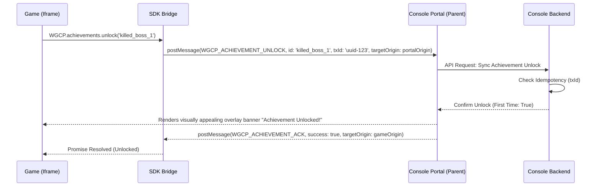

# Game Services API Specification (P-003)

This proposal defines the design, messaging contracts, runtime interfaces, and concurrency handling for the **Web Game Console Platform (WGCP) Game Services API**. It builds directly on the hardened transport, security model, origin verification protocols, and storage tiering introduced in [`P-002-game-sdk-storage-sync.md`](/proposals/P-002-game-sdk-storage-sync.md) to support high-level platform capabilities: Identity, Achievements, Leaderboards, Telemetry/Lifecycle tracking, System Settings, Player Stats, Personal Bests, and Progressions.

---

## 1. Overview & Architectural Goals

The WGCP Game Services API provides a set of features that help games integrate with the console ecosystem. Rather than just acting as a save-game synchronizer, the SDK enables games to communicate their state changes to the portal and adjust their gameplay based on console-wide settings (such as muting audio or changing language locales).

### Core Goals:
1. **Decoupled Architecture**: Games remain self-contained. The SDK provides a unified frontend that falls back to in-memory mocks when the game is played standalone.
2. **Unified UX Overlay**: Achievements and system settings are displayed to players through a consistent portal user interface, rather than each game styling these elements separately.
3. **Decoupled Analytics & Stats**: Separating player statistics and progression metrics from heavy game-save files allows the portal to aggregate player summaries across different titles without parsing game-specific binary saves.
4. **Optimized Latency**: Non-blocking asynchronous RPC calls ensure game loop rendering is never blocked by network requests to the console backend.

---

## 2. Division of Services & Trust Boundaries

To enforce security and reliability, services are divided into clear operational tiers based on trust and complexity.

### 2.1. Architectural Tiers

| Service Name | SDK (Client/Iframe) | Portal Wrapper (Parent) | Console Backend / Database | Trust Tier |
| :--- | :--- | :--- | :--- | :--- |
| **Identity** | Read-only access to basic profile fields (ID, name, avatar). | Brokers session state, prevents credential exposure. | Stores accounts, manages tokens, generates secure IDs. | **High Trust** (Portal-Only Auth) |
| **Achievements** | Invokes unlock/increment actions (with UUIDv4 `txId`). | Renders visual unlock notification banners. | Validates idempotency (`txId`), updates player achievement tables. | **Self-Trusted Event** (Score limits validated backend) |
| **Leaderboards** | Submits score payload, queries active leaderboard lists. | Injects tamper-resistant portal signature headers & telemetry snapshots. | Performs validation (velocity, anomaly, signature checks). | **Untrusted Claim** (Rigorous backend audit) |
| **System Settings** | Subscribes to events, reads locale/theme/audio constraints. | Detects browser language/system mute, notifies iframe. | Saves user preferences across multiple portal boots. | **Medium Trust** (Sync client preferences) |
| **Telemetry** | Emits performance events only; load/play lifecycle is derived by the portal wrapper, not the SDK.[^i005-boundary-audit] | Derives loading/gameplay lifecycle from iframe DOM & focus events, appends session details, logs client browser performance. | Accumulates usage metrics and builds console dashboard. | **Self-Trusted Metrics** |
| **Player Stats** | Sets/increments numerical stat counters with double-buffering. | Deduplicates flushes via `batchId`, manages offline queue. | Aggregates stat values, updates progress parameters. | **Self-Trusted Event** (Validated against bounds) |
| **Progressions** | Queries level details, adds experience points. | Coordinates leveling unlocks or animation events. | Computes XP thresholds, evaluates leveling curves. | **Untrusted Claim** (Validated server-side) |

### 2.2. Game Identity in Service Calls
All service modules below (Achievements, Leaderboards, Player Stats, Progression) resolve the acting game context the same way P-002 resolves it for storage: the portal derives `gameId` by conjunctively matching the `postMessage` event's `event.source` against the active iframe's `contentWindow` and verifying `event.origin === canonicalGameOrigin`. All outgoing messages emitted by the Portal or SDK must specify the explicit canonical target origin; wildcard `targetOrigin: '*'` is strictly prohibited. No module payload includes a client-declared `gameId` field, and the portal backend **must not** trust one if present — this prevents a compromised game iframe from writing achievements, scores, or stats against another game's identity.[^i005-boundary-audit]

### 2.3. Deferred Capabilities
To ensure a focus on stability, the following features are excluded from this specification and deferred to future proposals:
* **Multiplayer Matchmaking Lobbies**: Real-time room allocation, matchmaking queues, and NAT traversal. (Deferred: Games must manage their own servers, e.g. `BrowserQuest`).
* **Monetization & Ads**: Video ad triggers, commercial breaks, rewarded ad flows.
* **In-Game Overlay Rendering**: Forcing complex custom UI graphics inside the game iframe container from the parent. (The portal will render overlay visuals in its own DOM namespace, layered on top of the iframe).
* **Social Systems**: In-game player-to-player direct messaging and friends lists APIs.

---

## 3. Core API Modules & Payload Specifications

Building on the `RPCMessage` envelope defined in [`P-002-game-sdk-storage-sync.md`](/proposals/P-002-game-sdk-storage-sync.md), the following sections outline the specific APIs exposed to games.

### 3.1. Identity Module (`WGCP.identity`)
Provides games with read-only context on the active player. It does not provide any session tokens or passwords.

#### Methods:
```typescript
interface WGCPUser {
  playerId: string;      // Hashed user ID
  displayName: string;   // Display name
  avatarUrl?: string;    // Profile image URL
  isGuest: boolean;      // True if player has not logged in
}

// Retrieves current user info.
function getPlayer(): Promise<WGCPUser>;

// Event fired when authentication state transitions (e.g., guest logs in).
function onPlayerChanged(callback: (user: WGCPUser) => void): void;
```

---

### 3.2. Achievements Module (`WGCP.achievements`)
Handles unlocking achievements. Achievements are defined in the game's registration metadata (`game.yaml`) and registered in the database.



#### Methods:
```typescript
interface AchievementProgress {
  achievementId: string;
  percentComplete: number; // 0 to 100
  unlocked: boolean;
  lastUpdated: number;
}

// Unlocks an achievement.
function unlock(achievementId: string): Promise<boolean>;

// Increments a progressive achievement (e.g., killed 5 of 10 monsters).
function increment(achievementId: string, step: number): Promise<AchievementProgress>;

// Gets all achievements progress for this game.
function getProgress(): Promise<AchievementProgress[]>;
```

---

### 3.3. Leaderboards Module (`WGCP.leaderboards`)
Manages score submissions and queries. The console backend validates score submissions to reduce the risk of scoreboard tampering.

#### Methods:
```typescript
interface ScoreEntry {
  rank: number;
  displayName: string;
  score: number;
  metadata?: string;    // Optional context (e.g. "Weapon: Fireball", "Level: 4")
  timestamp: number;
  isMe: boolean;
}

interface LeaderboardQuery {
  limit?: number;        // Default: 10
  offset?: number;
  aroundPlayer?: boolean;// If true, returns rankings near the active player
}

// Submits a score.
function submitScore(leaderboardId: string, score: number, metadata?: string): Promise<void>;

// Retrieves leaderboards list.
function getScores(leaderboardId: string, query?: LeaderboardQuery): Promise<ScoreEntry[]>;
```

#### Score Submission Verification Flow:
To prevent players from submitting artificial high scores, score submission uses a two-phase check. The verification token authenticates that a submission passed through the brokered portal channel, but a token alone does **not** vouch for any particular score value — it must be explicitly bound to a plausibility snapshot at issuance, or the flow only stops unbrokered forgery while leaving a compromised-but-brokered game client free to submit an arbitrary score.[^i006-leaderboard-identity-audit]

1. When `submitScore` is called, the SDK requests a score transaction token from the parent portal.
2. The portal registers a temporary write transaction with the backend, embedding a **telemetry snapshot** (session length, game activity, and any `reportPerformance`/stat signals observed for this session so far). This snapshot is bound to the issued token, not just logged alongside it.
3. The token is **single-use and short-lived**: it is invalidated on first redemption and expires after a bounded window (default: same order of magnitude as typical session length for the game, configured per leaderboard). Untrusted-claim calls (`submitScore`, `unlockAchievement`) are excluded from the offline sync queue defined in [P-002 §2.4](/proposals/P-002-game-sdk-storage-sync.md) — a token issued before going offline cannot be redeemed after reconnecting once expired, and queuing a submission for later delivery would let its embedded telemetry snapshot go stale relative to the score it is meant to justify.[^i006-leaderboard-identity-audit]
4. The server validates the verification token when the score payload is submitted, rejecting direct, non-brokered requests **and** rejecting scores that are implausible given the token's bound telemetry snapshot (e.g. a score requiring far more gameplay activity than the snapshot's session length/game-activity data supports).

---

### 3.4. System Settings, Lifecycle & Overlay Security (`WGCP.system` & `WGCP.time`)
Enables the game to adapt to system preferences configured on the console portal dashboard and respond securely to UI lifecycle events (pause/resume).

#### Methods:
```typescript
interface SystemSettings {
  locale: string;        // Active display language (e.g., 'en-US', 'es-ES')
  muted: boolean;        // Console master mute status
  volume: number;        // Master volume (0.0 to 1.0)
  theme: 'console-dark' | 'console-light' | 'console-retro';
}

interface ResumeContext {
  pausedDurationMs: number;
  resumeTimestamp: number;
}

// Gets current settings.
function getSettings(): SystemSettings;

// Registers listener to update UI when settings shift.
function onSettingsChanged(callback: (settings: SystemSettings) => void): void;

// Registers listener to pause game rendering/loops when portal overlays open.
function onPause(callback: () => void): void;

// Registers listener to resume game rendering/loops when portal overlays close.
function onResume(callback: (context: ResumeContext) => void): void;
```

#### Overlay Input & Execution Handling:
When displaying the system menu, conflict resolution modal, or other overlays:
1. **Lifecycle Emission**: The Portal wrapper emits a `WGCP_PAUSE` postMessage to the iframe, triggering the game's `onPause` callback.
2. **DOM Inertness**: The Portal assigns the `inert` attribute and sets the iframe's `tabIndex = -1` to prevent keyboard or DOM focus leaks.
3. **SDK Gamepad Sandbox Proxy**: Because W3C Gamepad API polling (`navigator.getGamepads()`) operates outside the DOM tree and bypasses HTML `inert`, the SDK automatically proxies `navigator.getGamepads()`. While `WGCP_PAUSE` is active, the proxy returns neutral/zeroed gamepad objects (all buttons `pressed: false`, `value: 0.0`, all axes `0.0`). This completely eliminates controller input bleed while the player navigates the portal's overlay menus.[^i007-proposal-security-audit]
4. **Web Audio & Media Suspension**: On `WGCP_PAUSE`, the SDK automatically invokes `.suspend()` on active `AudioContext` instances and pauses HTML5 `<audio>` and `<video>` elements. On `WGCP_RESUME`, it automatically calls `.resume()`.
5. **Pointer Lock Release**: The Portal wrapper and SDK invoke `document.exitPointerLock()` immediately before displaying any modal overlay to free trapped mouse cursors.
6. **Synthetic Key Release**: On `WGCP_PAUSE`, the SDK emits synthetic `keyup` events for all currently tracked keys to prevent sticky/ghost keys upon resumption.
7. **Delta Time & Clock Calibration (`WGCP.time.getDelta`)**: `onResume` provides `{ pausedDurationMs, resumeTimestamp }`. The SDK exposes `WGCP.time.getDelta(currentTime?: number)` which automatically subtracts paused intervals and clamps maximum single-frame delta time to `0.1s` (100ms), preventing physics explosions ("spiral of death").
8. Upon closing the overlay, the Portal removes the input block and posts `WGCP_RESUME`, triggering the game's `onResume` callback.[^i007-proposal-security-audit]

---

### 3.5. Telemetry & Lifecycle Module (`WGCP.telemetry`)
Tracks client-side performance to help compile the console metrics dashboard. Loading-complete and gameplay start/stop lifecycle events are **not** part of the game-facing contract: the portal wrapper derives them without game code — `gameLoadingFinished` from the iframe's native DOM `onLoad` event, and `gameplayStart`/`gameplayStop` from iframe focus/blur transitions. Requiring explicit SDK calls for signals the host can already observe adds integration burden without adding information.[^i005-boundary-audit]

#### Methods:
```typescript
// Reports a custom performance event (e.g., framerate drops).
function reportPerformance(fps: number, memoryUsage?: number): void;
```

---

### 3.6. Player Stats Module (`WGCP.stats`)
Provides a structured model for storing, retrieving, and incrementing numerical counters. Following the pattern established by EOS and Steamworks, updating a statistic uses **deltas** to prevent out-of-order errors when syncing offline queues.

#### Offline Stats Queuing, Double-Buffering & Delta Aggregation:
To prevent offline telemetry from causing save progress loss:
1. **Queue Partitioning**: Player Stats updates are stored in a dedicated offline Stats Queue that is entirely separate from P-002's 10-slot persistence (`WGCP.storage.save`) queue. High-frequency stat updates will never evict core save slots.[^i007-proposal-security-audit]
2. **Double-Buffering Delta Engine**: The Stats Queue maintains a two-stage buffer (Active Buffer and In-Flight Batch) to prevent concurrency races between game updates and network flushes:
   * **Active Buffer**: Consolidates incoming numerical updates per `statId` in memory. If a game registers multiple delta updates (e.g. `incrementStat('gold', 1)` followed by `incrementStat('gold', 50)`), they consolidate into a single entry (`gold += 51`) occupying exactly one queue slot.
   * **`setStat` vs `incrementStat` Coalescing**:
     $$\begin{array}{|l|l|l|}
     \hline
     \textbf{Existing Entry } (E_{\text{active}}) & \textbf{New Operation } (O_{\text{new}}) & \textbf{Resulting Entry } (E'_{\text{active}}) \\
     \hline
     \emptyset \text{ (None)} & \text{DELTA}(d) & \text{DELTA}(d) \\
     \emptyset \text{ (None)} & \text{SET}(v) & \text{SET}(v) \\
     \text{DELTA}(d_1) & \text{DELTA}(d_2) & \text{DELTA}(d_1 + d_2) \\
     \text{DELTA}(d_1) & \text{SET}(v) & \text{SET}(v) \\
     \text{SET}(v_1) & \text{DELTA}(d_2) & \text{SET}(v_1 + d_2) \\
     \text{SET}(v_1) & \text{SET}(v_2) & \text{SET}(v_2) \\
     \hline
     \end{array}$$
   * **In-Flight Batch Swapping & Idempotent `batchId`**: Upon initiating a flush, the Active Buffer is swapped into an In-Flight Batch tagged with a unique `batchId` (UUIDv4). New game updates continue into a clean Active Buffer without main thread stalling.
   * **Idempotent Acknowledgment & Re-Merge on NACK**: The Portal backend logs processed `batchId`s to prevent duplicate counting during network retries. On ACK (`WGCP_STATS_ACK`), the in-flight batch is dropped and verified server state is stored in `stats_cache`. On NACK or timeout, the in-flight batch is atomically re-merged into the Active Buffer:
     - In-Flight `DELTA` + Active $\emptyset \rightarrow \text{DELTA}(d_{\text{inf}})$
     - In-Flight `DELTA` + Active `DELTA` $\rightarrow \text{DELTA}(d_{\text{inf}} + d_{\text{act}})$
     - In-Flight `DELTA` + Active `SET` $\rightarrow \text{SET}(v_{\text{act}})$
     - In-Flight `SET` + Active `DELTA` $\rightarrow \text{SET}(v_{\text{inf}} + d_{\text{act}})$
     - In-Flight `SET` + Active `SET` $\rightarrow \text{SET}(v_{\text{act}})$
3. **Local Durability & Crash Recovery**: To prevent progress loss if the browser tab crashes or closes while offline, active queue deltas are persisted to an isolated IndexedDB object store (`stats_queue` in `wgcp_storage_<gameId>`) with a 100ms debounce. On boot, un-flushed deltas are restored into the active queue.
4. **Read-Your-Own-Writes Consistency**: Calls to `getStat(statId)` and `getStats()` immediately return the monotonic coalesced value:
   $$\text{Value}_{\text{effective}} = \text{Value}_{\text{synced}} + \Delta_{\text{in-flight}} + \Delta_{\text{active}}$$
   (or the latest active `SET` value), guaranteeing immediate visibility of writes before server ACK.
5. **Queue Bounds & Transmission Limits**:
   * **Unique Key Capacity**: Maximum 100 unique `statId` entries. Adding a 101st distinct stat key while offline or un-flushed rejects with `ERROR_QUEUE_FULL`.
   * **Debounce & Flush Intervals**: Updates flush after a debounce window of 1,500ms of inactivity, or when a hard throttle ceiling of 5,000ms is reached during continuous updates.
   * **Batch Transmission Size**: Flushes are chunked to a maximum of 50 stat entries per `postMessage` envelope.
   * **Numeric Validation**: All amounts must be finite numbers. `NaN`, `Infinity`, and non-numeric inputs immediately reject with `ERROR_INVALID_PARAMETER`. Values are bounded to `Number.MAX_SAFE_INTEGER`.
6. **Lifecycle Flush Triggers**: The SDK triggers an immediate flush on `document.visibilitychange` (`hidden`), `window.pagehide`, and prior to iframe unmounting.

#### Methods:
```typescript
interface StatOperation {
  op: 'DELTA' | 'SET';
  value: number; // delta amount or absolute target value
}

interface StatDeltaPayload {
  batchId: string;       // Unique UUIDv4 for flush idempotency
  timestamp: number;
  operations: Record<string, StatOperation>;
}

interface PlayerStat {
  statId: string;
  value: number;
  lastUpdated: number;
}

interface PersonalBest {
  leaderboardId: string;
  score: number;
  achievedAt: number;
  metadata?: string;
}

// Retrieves a specific stat value (monotonic coalesced: synced + in-flight + active)
function getStat(statId: string): Promise<number>;

// Sets a stat value directly
function setStat(statId: string, value: number): Promise<void>;

// Increments a stat value (e.g. gold + 50, deaths + 1)
function incrementStat(statId: string, amount: number): Promise<number>;

// Retrieves all stats tracked for the active game
function getStats(): Promise<PlayerStat[]>;

// Retrieves the player's personal high-water mark for a leaderboard
function getPersonalBest(leaderboardId: string): Promise<PersonalBest | null>;
```

---

### 3.7. Progression Module (`WGCP.progression`)
Provides native support for leveling systems and experience points (XP) tracks.

#### Methods:
```typescript
interface PlayerProgression {
  level: number;         // Calculated level
  currentXP: number;     // Active XP in level
  totalXP: number;       // Lifetime XP
  xpRequiredForNext: number; // XP remaining until next level-up
}

// Submits XP to the player's profile.
// The promise resolves with the updated progression structure, including a flag indicating if they leveled up.
function addXP(amount: number): Promise<{ progression: PlayerProgression; leveledUp: boolean }>;

// Retrieves the player's current progression details
function getProgression(): Promise<PlayerProgression>;
```

---

## 4. Standardized Error Handling Schema

All service failures returned by the parent portal or backend must map to a unified client error structure in the SDK promise response.

### 4.1. Error Envelope
```typescript
interface WGCPError {
  code: string;         // Standardized system error code
  message: string;      // Human-readable debug description
  details?: {
    queueType?: 'STORAGE' | 'STATS';
    maxCapacity?: number;
    currentSize?: number;
    statId?: string;
    slot?: string;
    retryAfterMs?: number;
    [key: string]: any;
  };
}
```

### 4.2. Defined Error Codes

| Error Code | Meaning | Remediation / Handling |
| :--- | :--- | :--- |
| `ERROR_NOT_INITIALIZED` | Service function called before `WGCP.init()` handshake resolves. | Call `WGCP.init()` and wait for resolution. |
| `ERROR_UNAUTHENTICATED` | Action requires logged-in user but player is a guest. | SDK falls back to guest mode or prompts login. |
| `ERROR_RATE_LIMIT` | Game is emitting too many telemetries or save calls. | Implement debouncing inside game client logic. |
| `ERROR_INVALID_PARAMETER` | Parameter type mismatch, `NaN`/`Infinity`, or invalid key format. | Validate arguments before calling SDK methods. |
| `ERROR_IDEMPOTENCY_CONFLICT` | Achievement/score transaction has already been processed. | Discard duplicate message safely. |
| `ERROR_TAMPER_DETECTED` | Payload checksum or backend token validation failed. | Reject write, reset session parameters. |
| `ERROR_PORTAL_DISCONNECTED`| Communication with parent window has timed out. | Fall back immediately to offline-first local cache. |
| `ERROR_SYNC_PENDING_RESOLUTION`| Save called while a sync conflict resolution overlay is active. | Reject save immediately, prompt resolution. |
| `ERROR_QUEUE_FULL` | Synchronization queue or Stats queue capacity exceeded. | Warn player, restrict further writes until online. |
| `ERROR_SYNC_ABORTED` | In-flight save was cancelled because user discarded local progress. | Clean up pending callbacks, rehydrate state. |
| `ERROR_MIGRATION_IN_PROGRESS` | Storage operation called while guest account is migrating. | Retry operation after `onPlayerChanged` fires. |

---

## 5. References & Audit Notes

[^i005-boundary-audit]: WGCP SDK Completeness and Boundary Scrutiny (`/investigations/I-005-sdk-completeness-and-boundary-scrutiny.md`)
[^i006-leaderboard-identity-audit]: Leaderboard & Identity Boundary Audit (`/investigations/I-006-leaderboard-identity-boundary-audit.md`)
[^i007-proposal-security-audit]: Proposal Security, Race-Condition, and Queue Audit (`/investigations/I-007-proposal-security-race-queue-audit.md`)
[^i008-proposals-iterative-scrutiny]: Proposals Iterative Scrutiny and Hardening Report (`/investigations/I-008-proposals-iterative-scrutiny.md`)
