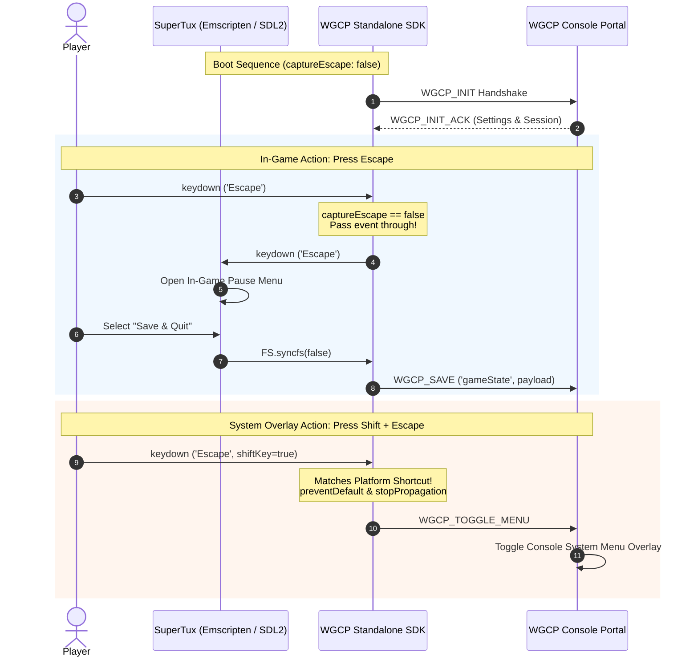

# Proposal (P-005) - Configurable Game SDK Initialization and Escape Key Handling

## 1. Context & Motivation

Under P-004[^p004-launch-refactor] and D-006,[^d006-invariants] the standalone WGCP Game SDK (`wgcp-sdk.js`) centralized capturing-phase `Escape` key interception inside `WGCP.init()` to toggle the portal system overlay menu (`WGCP_TOGGLE_MENU`) and prevent keyboard trapping inside cross-origin game iframes.[^i010-viewport-escape]

While this global behavior works seamlessly for casual web games (e.g. *2048*, *Hextris*, *A Dark Room*, *BrowserQuest*) that do not utilize the `Escape` key, it creates a fatal input collision in complex desktop and WebAssembly games (e.g. *SuperTux*, *Doom*, *Quake*, emulators):
1. **In-game Pause Menu Hijack**: In SuperTux, `Escape` is the primary controller for the in-game pause menu, sub-menu back navigation, and clean level quitting.
2. **Prevented Save Sequence**: Calling `e.preventDefault()` and `e.stopPropagation()` in the SDK's capturing-phase listener completely starved the Emscripten/SDL2 engine of `Escape` events.
3. **Abrupt Process Termination**: Players unable to reach the native in-game pause menu or "Save and Quit" dialog closed windows abruptly, missing game save triggers and causing perceived data loss.

---

## 2. Proposed Specification

### 2.1 The `WGCPInitOptions` Interface

To allow game developers to customize platform behavior while maintaining backwards compatibility with existing hosted games, `WGCP.init()` accepts an extensible options object:

```typescript
export interface WGCPInitOptions {
  /** Optional array of allowed origins for postMessage validation */
  allowedOrigins?: string[];

  /**
   * Whether the SDK should intercept and consume the raw 'Escape' keypress
   * to toggle the console platform overlay.
   * 
   * @default true
   */
  captureEscape?: boolean;

  /**
   * Optional custom shortcut descriptor for toggling the platform menu.
   * Defaults to 'Shift+Escape' when captureEscape is false.
   */
  menuShortcut?: string;
}
```

### 2.2 Dual-Tier Keyboard Handling Mechanics

The key listener attached by `WGCP.init()` operates with dual-tier evaluation:

1. **Default Mode (`captureEscape: true` or omitted)**:
   * Intercepts raw `Escape` keypresses (`e.key === 'Escape' && !e.shiftKey && !e.altKey && !e.ctrlKey && !e.metaKey`).
   * Calls `e.preventDefault()` and `e.stopPropagation()` to prevent iframe trapping.
   * Dispatches `WGCP_TOGGLE_MENU` RPC message to parent portal.
   * *Backwards compatibility*: Existing casual games require zero code changes.

2. **Passthrough Mode (`captureEscape: false`)**:
   * Skips intercepting raw `Escape` keypresses, allowing them to bubble untouched into the game engine's event loop (e.g. SDL2/Emscripten keydown handlers).
   * Automatically recognizes the **`Shift + Escape`** chord (`e.key === 'Escape' && e.shiftKey`) as a dedicated platform overlay trigger.
   * Calls `preventDefault()` / `stopPropagation()` only on `Shift + Escape` to dispatch `WGCP_TOGGLE_MENU`.

---

## 3. Working Architecture & Integration Example



### 3.1 SuperTux Integration Blueprint

In `mk/emscripten/template.html.in`:

```javascript
Module.preRun.push(function () {
  if (typeof window.WGCP !== 'undefined') {
    Module.addRunDependency('wgcp_init');

    window.WGCP.init({
      captureEscape: false // Pass raw Escape to SuperTux pause menu
    }).then(function () {
      wasmBridge = window.WGCP.wasm.install({
        mountPath: root,
        slot: 'gameState',
        fs: typeof FS !== 'undefined' ? FS : (window.FS || Module.FS),
        debounceMs: 500
      });
      return wasmBridge.restoreFromCloud();
    }).finally(function () {
      Module.removeRunDependency('wgcp_init');
    });
  }
});
```

---

## 4. Acceptance Invariants

1. **Backwards Compatibility**: Calling `WGCP.init()` without arguments defaults `captureEscape` to `true`, ensuring all previously integrated games behave identically.
2. **Deterministic In-Game Menus**: Games passing `captureEscape: false` receive 100% of raw `Escape` keystrokes without interference from SDK listeners.
3. **Guaranteed Console Escape Hatch**: Regardless of `captureEscape` configuration, `Shift + Escape` is always registered as a global console overlay toggle.

---

[^p002-storage-sync]: Game SDK & Portal Synchronization Specification (`/proposals/P-002-game-sdk-storage-sync.md`)
[^p004-launch-refactor]: Viewport-First Game Launch Refactoring (`/proposals/P-004-game-launch-refactor.md`)
[^d006-invariants]: BigInt Epoch Timestamps, SDK Feature Centralization, and Test Isolation (`/decisions/D-006-epoch-timestamp-and-sdk-invariants.md`)
[^i010-viewport-escape]: Viewport-First Launch Escape Key Regression (`/investigations/I-010-viewport-escape-regression.md`)
