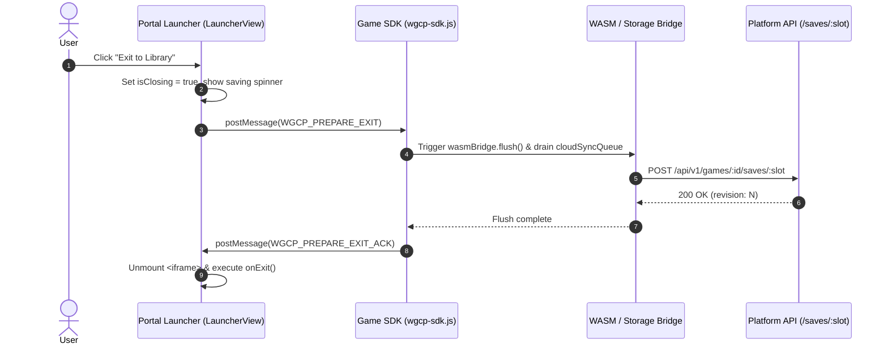

# Proposal (P-007) - Graceful Game Exit Handshake Protocol (`WGCP_PREPARE_EXIT`)

## 1. Context & Motivation

Under the current console portal architecture ([`LauncherView.tsx`](/portal/frontend/src/views/LauncherView.tsx)),[^portal-launcherview] when a player clicks **Exit to Library** in the system overlay menu or closes the game session, the portal immediately unmounts the game `<iframe />` from the DOM tree.

As revealed in investigation **I-013**[^i013-unload-investigation] and finding **F-005**,[^f005-unload-finding] abrupt iframe unmounting creates a fatal state loss vulnerability for games with asynchronous save pipelines (such as WebAssembly / Emscripten games using `IDBFS` and the WGCP WASM bridge):[^sdk-wasm]

1. **Synchronous `unload` Execution Constraint**: When an iframe is unmounted, the browser synchronously triggers the `unload` and `pagehide` events. Browsers immediately kill all pending asynchronous microtasks, Web Crypto promises (`calculateChecksum`), IndexedDB transactions, and `postMessage` channels upon returning from the synchronous handler frame.
2. **Cancelled In-Flight Debounced Saves**: The WASM storage bridge throttles VFS cloud synchronizations with a 500ms debounce timer. Exiting within 500ms of a checkpoint or level completion clears the timer during `flush()`, but the subsequent asynchronous cloud upload (`WGCP_SAVE`) is terminated before completion.
3. **Missing Teardown Coordination**: While the platform has comprehensive handshakes for game booting (`WGCP_INIT`), storage conflict resolution (`WGCP_CONFLICT_TRIGGER`), and permission requests (`WGCP_REQUEST_PERMISSION`),[^p002-storage-sync] it lacks a symmetrical **graceful exit protocol**.

---

## 2. Proposed Specification

This proposal introduces a bidirectional RPC lifecycle signal: **`WGCP_PREPARE_EXIT`** and its corresponding response **`WGCP_PREPARE_EXIT_ACK`**.



### 2.1 Message Envelope Schemas

#### 1. Portal Request Envelope: `WGCP_PREPARE_EXIT`
Sent by the console portal wrapper (`LauncherView.tsx`) to the game `contentWindow` before initiating teardown:

```typescript
export interface WGCPPrepareExitMessage {
  id: string; // Correlation UUIDv4
  type: 'WGCP_PREPARE_EXIT';
  source: 'WGCP_PORTAL';
  version: '2.0.0';
  payload: {
    /** Maximum time budget in milliseconds allocated by portal before forced kill */
    timeoutMs?: number; // Defaults to 600ms
  };
}
```

#### 2. Game Response Envelope: `WGCP_PREPARE_EXIT_ACK`
Dispatched by the Game SDK back to `window.parent` once all dirty buffers, VFS mounts, and queued sync tasks have reached the network or local database:

```typescript
export interface WGCPPrepareExitAckMessage {
  id: string; // Matching Correlation UUIDv4
  type: 'WGCP_PREPARE_EXIT_ACK';
  source: 'WGCP_SDK';
  version: '2.0.0';
  payload: {
    /** Indicates whether all pending storage operations were successfully flushed */
    flushed: boolean;
    /** Number of slots synced during the teardown sequence */
    syncedSlots?: string[];
    /** Error description if flush partially failed */
    error?: string;
  };
}
```

---

### 2.2 Game SDK Teardown Lifecycle Handling

Inside `sdk/src/index.ts`,[^p002-storage-sync] incoming `WGCP_PREPARE_EXIT` messages trigger an automated state synchronization drain:

```typescript
if (type === 'WGCP_PREPARE_EXIT') {
  const exitHandlers: Promise<any>[] = [];

  // 1. Flush active WASM IDBFS bridge if attached
  if (typeof (window as any)._activeWasmBridge?.flush === 'function') {
    exitHandlers.push((window as any)._activeWasmBridge.flush());
  }

  // 2. Trigger registered custom teardown hooks
  systemListeners.onPrepareExit.forEach((fn) => {
    try {
      exitHandlers.push(Promise.resolve(fn()));
    } catch (err) {
      console.warn('[WGCP SDK] Error executing custom prepareExit hook:', err);
    }
  });

  // 3. Await all pending saves and respond with ACK
  Promise.allSettled(exitHandlers).then((results) => {
    const hasError = results.some((r) => r.status === 'rejected');
    window.parent.postMessage({
      id,
      type: 'WGCP_PREPARE_EXIT_ACK',
      source: 'WGCP_SDK',
      version: '2.0.0',
      payload: {
        flushed: !hasError,
        error: hasError ? 'One or more storage flushes failed' : undefined
      }
    }, portalOrigin);
  });
  return;
}
```

---

### 2.3 Public SDK Extension: `WGCP.system.onPrepareExit`

Games with custom caching, WebGL buffers, or database workers can register asynchronous teardown callbacks:

```typescript
// Game integration usage
window.WGCP.system.onPrepareExit(async () => {
  // Flush internal game state, level progress, or telemetry
  await myCustomSaveSystem.flush();
});
```

---

### 2.4 Portal Teardown Timing & Safety Budget

To guarantee that a hung or unresponsive game cannot freeze the console UI during library navigation:

1. **Timeout Fallback Budget**: `LauncherView.tsx` imposes a strict **600ms timeout budget**.
2. **Race Resolution**: If the game responds with `WGCP_PREPARE_EXIT_ACK` within 600ms, the portal proceeds to teardown immediately. If the timer expires before ACK is received, the portal logs a warning and forcefully unmounts the iframe without blocking navigation.
3. **Visual Feedback**: The system overlay transitions to an animated saving state (*"Saving progress..."*) during the exit handshake window.

```typescript
// portal/frontend/src/views/LauncherView.tsx
const handleExitToLibrary = async () => {
  setIsClosing(true);
  
  const iframe = iframeRef.current;
  if (iframe && iframe.contentWindow) {
    const correlationId = crypto.randomUUID();
    
    await new Promise<void>((resolve) => {
      const timeoutId = window.setTimeout(() => {
        console.warn('[WGCP Portal] Exit handshake timed out after 600ms. Forcing exit.');
        window.removeEventListener('message', handleExitAck);
        resolve();
      }, 600);

      function handleExitAck(event: MessageEvent) {
        if (
          event.data?.type === 'WGCP_PREPARE_EXIT_ACK' &&
          event.data?.id === correlationId
        ) {
          window.clearTimeout(timeoutId);
          window.removeEventListener('message', handleExitAck);
          resolve();
        }
      }

      window.addEventListener('message', handleExitAck);

      iframe.contentWindow!.postMessage({
        id: correlationId,
        type: 'WGCP_PREPARE_EXIT',
        source: 'WGCP_PORTAL',
        version: '2.0.0',
        payload: { timeoutMs: 600 }
      }, expectedGameOrigin);
    });
  }

  setIsClosing(false);
  onExit();
};
```

---

## 3. Backwards Compatibility & Fallback Guarantees

* **Legacy / Un-instrumented Games**: If a hosted game does not implement `WGCP_PREPARE_EXIT` (or runs an older SDK version), the 600ms safety timer resolves smoothly without breaking existing navigation workflows.
* **Emergency Browser Tab Closure**: For abrupt window closures (`Ctrl+W` / browser tab close) where `LauncherView` is also terminated, the synchronous `localStorage` snapshot in `supertux_saveFiles()` (Tier 2 in investigation I-013)[^i013-unload-investigation] acts as the zero-dependency local fail-safe.

---

## 4. Verification & Testing Strategy

1. **Unit Tests (`sdk/src/storage/wasm.test.ts`)**:
   - Verify that `WGCP_PREPARE_EXIT` calls `wasmBridge.flush()` and returns `WGCP_PREPARE_EXIT_ACK`.
   - Verify that multiple registered `onPrepareExit` callbacks execute concurrently within `Promise.allSettled`.
2. **E2E Integration Test (`portal/frontend/e2e/sdk-integrations.spec.ts`)**:
   - Launch SuperTux, modify VFS level state, click **Exit to Library** through the System Menu overlay.
   - Assert that `POST /api/v1/games/supertux/saves/gameState` is received and resolved with HTTP 200 before the iframe element is detached.
   - Reopen SuperTux in a fresh browser context and verify that the rehydrated save includes the latest modifications.

[^portal-launcherview]: Console Portal LauncherView Component ([/portal/frontend/src/views/LauncherView.tsx](/portal/frontend/src/views/LauncherView.tsx))
[^i013-unload-investigation]: SuperTux Unload Save & Cloud Synchronization Failure ([/investigations/I-013-supertux-unload-save-sync-failure.md](/investigations/I-013-supertux-unload-save-sync-failure.md))
[^f005-unload-finding]: SuperTux WASM Unload Save State Drop & Cloud Sync Failure ([/findings/F-005-supertux-wasm-unload-cloud-sync-failure.md](/findings/F-005-supertux-wasm-unload-cloud-sync-failure.md))
[^sdk-wasm]: WGCP SDK WASM Storage Bridge ([/sdk/src/storage/wasm.ts](/sdk/src/storage/wasm.ts))
[^p002-storage-sync]: Game SDK & Portal Synchronization Specification ([/proposals/P-002-game-sdk-storage-sync.md](/proposals/P-002-game-sdk-storage-sync.md))
[^p005-sdk-init]: Configurable Game SDK Initialization and Escape Key Handling ([/proposals/P-005-configurable-sdk-initialization-and-escape-forwarding.md](/proposals/P-005-configurable-sdk-initialization-and-escape-forwarding.md))
