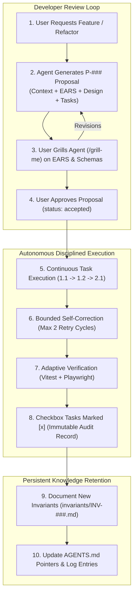

# Proposal (P-008) - Spec-Driven Development Workflow Harmonization

## 1. Context & Motivation

As AI coding agents take on multi-file architectural responsibilities across the Web Game Console Platform (WGCP), conversational "vibe-coding" creates compounding technical debt: multi-system RPC interface drift, platform invariant violations, and ambiguity during proposal reviews.

As established in investigation **I-014**,[^i014-sdd-eval] adopting a heavy 3-file suite (`.specs/requirements.md`, `design.md`, `tasks.md`) introduces severe overhead and conflicts with WGCP's **Open Knowledge Format (OKF v0.2)** memory catalog.[^okf-spec]

This proposal defines the unified, harmonized workflow that brings the rigor of **Spec-Driven Development (SDD)** directly into WGCP's memory catalog while keeping developer review streamlined (**Ask $\rightarrow$ Grill $\rightarrow$ Accept $\rightarrow$ Implement**).

---

## 2. Requirements & Acceptance Criteria (EARS)

### Feature: Unified Proposal Specification & Granularity
* **R1.1 (EARS Syntax in Proposals)**: 
  * `WHEN an agent generates or modifies a proposal (P-###) THEN the proposal SHALL include a dedicated 'Requirements & Acceptance Criteria' section formatted strictly using EARS syntax.`
* **R1.2 (System Boundary Scoping)**:
  * `WHEN authoring EARS requirements THEN the criteria SHALL focus on system boundaries (API contracts, RPC postMessage envelopes, database schemas, lifecycle state transitions, and error recovery modes), leaving internal helper functions to design discretion.`
* **R1.3 (Hierarchical Implementation Tasks)**:
  * `WHEN a proposal is drafted THEN the proposal SHALL include a 2-level hierarchical implementation task checklist (## Implementation Tasks with [ ] 1.1, [ ] 1.2) mapping directly to the EARS requirements.`
* **R1.4 (Test-Driven Traceability)**:
  * `WHEN defining implementation tasks for a proposal THEN the task list SHALL include explicit unit and Playwright integration test verification sub-tasks for all declared EARS requirements.`

### Feature: Execution Discipline, Verification & Error Recovery
* **R2.1 (Full Autonomy Execution Model)**:
  * `WHEN an implementation plan is initiated on an accepted proposal THEN the agent SHALL execute all tasks continuously in sequence without pausing for intermediate confirmation, stopping only upon test failure, compiler error, or an unexpected blocker.`
* **R2.2 (Bounded Autonomous Self-Correction)**:
  * `IF a unit/integration test or build fails during task execution THEN the agent SHALL perform up to 2 automated diagnostic and fix attempts; IF still unresolved after 2 attempts THEN the agent SHALL halt, document the blocker, and request developer guidance.`
* **R2.3 (Adaptive Verification Standard)**:
  * `WHEN verifying task execution THEN the agent SHALL execute TypeScript compile and Vitest unit tests for all changes, and SHALL additionally execute Docker service rebuild and Playwright E2E suites whenever backend routes, schemas, or storage contracts are modified.`
* **R2.4 (Selective Subagent Delegation)**:
  * `WHEN executing tasks THEN the agent SHALL execute sequentially in the primary thread by default, but MAY invoke specialized subagents for clearly decoupled tasks (e.g., isolated test generation or background research).`
* **R2.5 (Immutable Audit Completion Lifecycle)**:
  * `WHEN all implementation tasks are verified THEN the proposal SHALL remain in proposals/ as an immutable historical record with all checkboxes marked [x] and completion logs updated.`

### Feature: Defect Reproduction & Invariant Lifecycle
* **R3.1 (EARS in Findings)**:
  * `WHEN an audit, defect, or bug is documented in findings/F-###.md THEN the finding SHALL specify the reproduction condition and failure mode using EARS syntax before proposing a remediation.`
* **R3.2 (Dedicated Invariant Concept Type - INV-###)**:
  * `WHEN an architectural constraint or permanent system rule is established THEN it SHALL be recorded as an Invariant concept (invariants/INV-###-<slug>.md) under OKF v0.2 and linked from AGENTS.md.`
* **R3.3 (Pointer Model for AGENTS.md)**:
  * `AGENTS.md SHALL maintain a concise index of core golden rules and pointers to the .agents/memory/invariants/ catalog, avoiding context window bloat while maintaining strict agent enforcement.`

### Feature: Backwards Compatibility & Retrofitting
* **R4.1 (Retrofit Open Proposals Only)**:
  * `WHEN P-008 is accepted THEN existing open/draft proposals (specifically P-006) SHALL be retrofitted with EARS criteria and task checklists, while historical accepted proposals (P-001–P-005, P-007) remain preserved as historical records.`

---

## 3. Technical Design & Specification



### 3.1 Standardized Proposal Template (`P-###.md`)

```markdown
---
type: Proposal
proposal_id: P-###
title: {Feature Title}
description: {Concise summary of problem and solution}
status: proposed | accepted | rejected | superseded
generated: { by: antigravity/3.7, at: YYYY-MM-DDTHH:MM:SSZ }
sources:
  - id: {source-id}
    resource: {path-or-url}
    title: {title}
---

# Proposal (P-###) - {Feature Title}

## 1. Context & Motivation
[Background, existing limitations, architectural trade-offs, and affected components]

## 2. Requirements & Acceptance Criteria (EARS)
- **R1 (Ubiquitous)**: The [system] SHALL [response]
- **R2 (Event-Driven)**: WHEN [event] THEN [system] SHALL [response]
- **R3 (State-Driven)**: WHILE [state] the [system] SHALL [response]
- **R4 (Conditional)**: IF [precondition] WHEN [event] THEN [system] SHALL [response]

## 3. Technical Design & Schemas
- Architecture & sequence flows (`mermaid`)
- Database schemas & RPC message envelopes
- Routing & network topology rules (Caddy)

## 4. Implementation Tasks
- [ ] 1. Backend Persistence & API Layer
  - [ ] 1.1 Implement schema in `platform/backend/src/db/schema.ts`
  - [ ] 1.2 Add Fastify route handlers and validation schemas
- [ ] 2. SDK & Portal Integration
  - [ ] 2.1 Update `sdk/src/` runtime and build bundles
  - [ ] 2.2 Update `portal/frontend/` views and spatial navigation
- [ ] 3. Automated Verification & Testing
  - [ ] 3.1 Write unit tests in Vitest for SDK / API
  - [ ] 3.2 Write Playwright E2E integration tests validating R1–R4
```

### 3.2 Standardized Invariant Concept Template (`INV-###.md`)

Located in `.agents/memory/invariants/INV-###-<slug>.md`:

```markdown
---
type: Invariant
invariant_id: INV-###
title: {Invariant Title}
category: schema | storage | network | security | sdk | lifecycle
status: active | deprecated
origin: P-### | F-### | I-###
generated: { by: antigravity/3.7, at: YYYY-MM-DDTHH:MM:SSZ }
---

# Invariant (INV-###) - {Invariant Title}

## 1. Statement
[The exact normative rule that agents and developers MUST NOT violate]

## 2. Rationale & Historical Incident
[Why this invariant exists, referencing the originating finding or investigation]

## 3. Enforcement & Verification
[How this invariant is validated in linting, schemas, unit tests, or CI]
```

---

## 4. Implementation Tasks

- [x] 1. Memory Catalog Specification Update
  - [x] 1.1 Update `.agents/memory/memory_spec.md` to formally document the `Invariant` concept type (`INV-###`) and standardized EARS/Task sections for `Proposal` and `Finding` types.
  - [x] 1.2 Create `.agents/memory/invariants/` directory with `index.md` and `log.md`.
  - [x] 1.3 Populate initial `INV-###` records from existing [AGENTS.md](file:///home/vijaykoushik/Evee/My%20Documents/GitHub/Games/AGENTS.md) rules:
    - `INV-001-millisecond-epoch-bigint.md`
    - `INV-002-caddy-network-isolation.md`
    - `INV-003-sdk-feature-centralization.md`
    - `INV-004-wasm-exit-flush-handshake.md`
    - `INV-005-platform-trust-boundary.md`
- [x] 2. AGENTS.md Synchronization
  - [x] 2.1 Refactor [AGENTS.md](file:///home/vijaykoushik/Evee/My%20Documents/GitHub/Games/AGENTS.md) to serve as a high-signal bootstrap pointer to `.agents/memory/invariants/`.
- [x] 3. Retrofit Open Proposals
  - [x] 3.1 Retrofit `.agents/memory/proposals/P-006-declarative-achievements-leaderboards-schema.md` with standard EARS acceptance criteria and a 2-level hierarchical implementation task list.
- [x] 4. Verification & Catalog Consistency
  - [x] 4.1 Verify all cross-references across `.agents/memory/` and update proposal update logs.


---

[^i014-sdd-eval]: WGCP Investigation I-014. *Spec-Driven Development Evaluation & Workflow Synthesis*. `.agents/memory/investigations/I-014-spec-driven-development-evaluation-and-synthesis.md`.
[^okf-spec]: Open Knowledge Format (OKF v0.2). *WGCP Memory Catalog Specification*. `.agents/memory/memory_spec.md`.
